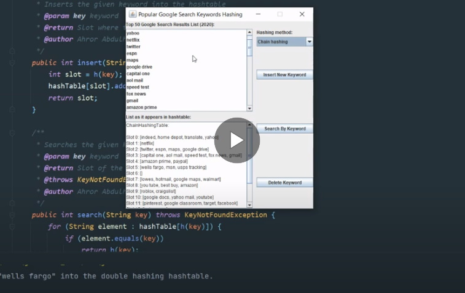

# Popular_Google_Search_Keywords_Hashing
Application that shows the list of the most popular google search keywords, and uses three different hashing methods to store them.


# Search_Engine_Simulator 2

> Application that shows the list of the most popular google search keywords, and uses three different hashing methods to manage them.
> The three hashing methods are: division with chaining, multiplication with chaining, and double hashing.
```diff 
- The source code is secured in the archive, and a password is required to access it. 
It was done  to prevent future students from copying it. 
Please, contact me if you need the access to the source code, and be sure state the reason.
```

To launch the application, double click the **HashingApp.jar** executable file. JDK 8 was used during the development of this application.

## Recorded Demo

[](https://youtu.be/4PAqxToVzjQ)

